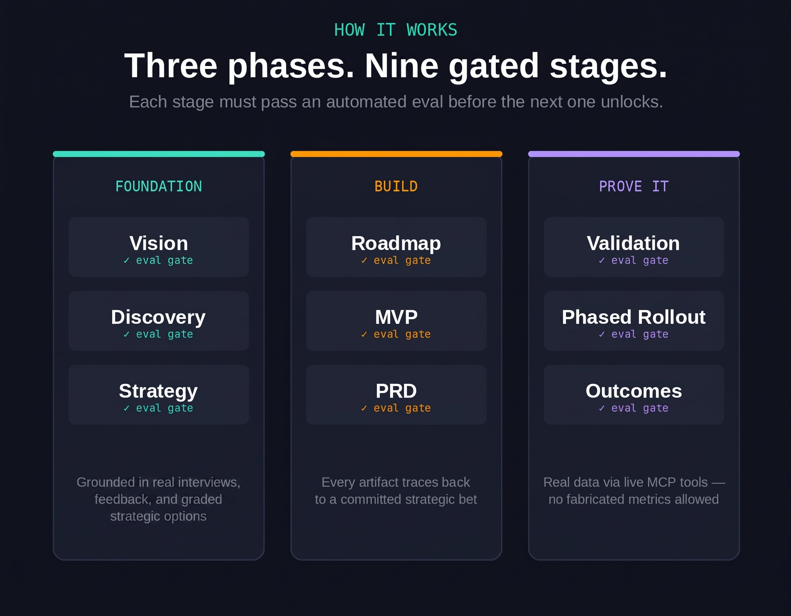

# AI PM OS

**Why this exists:** 
Product managers write the same nine documents on every product — a vision, some research, a strategy, a
roadmap, a spec, a test plan, a rollout plan, a results writeup — and it's
easy for the later documents to drift from the earlier ones without anyone
noticing until much later. This project makes an AI write those nine
documents *and* checks its own work at every step: each document has to
cite real evidence, pass a quality check, and clearly connect to the
document before it, before the next one gets started. The result is a
paper trail you can actually follow, from "here's the problem" all the way
to "here's what happened after we shipped it."



An agent/skill/MCP-orchestrated system that generates the artifacts a product
manager produces across a product's lifecycle - vision, discovery, strategy,
roadmap, MVP, PRD, validation, phased rollout, outcomes - with automated
evals gating each stage before the next begins.

Built as a **Claude Code project**: each pipeline stage is a subagent backed
by a skill (methodology + required structure), orchestrated by a top-level
`orchestrator` subagent, checked by a Python eval harness after every stage.

## How it works

```
vision -> discovery -> strategy -> roadmap -> mvp -> prd -> validation -> phased_rollout -> outcomes
```

This is a **strict, gated pipeline**: a stage's artifact must pass its eval
(structural completeness + optional LLM-judge quality check) before the
pipeline advances. If it fails, the stage agent revises and re-submits (up
to `max_attempts`, configured per stage in `pipeline/stage_config.py`)
before the orchestrator stops and asks a human to intervene.

Every stage:
1. Reads `artifacts/context.json` - the single shared state object every
   prior stage has written into
2. Reads its own `.claude/skills/<stage>/SKILL.md` for methodology and the
   exact section headings it must produce
3. Writes `artifacts/<stage>.md`
4. Gets scored by `evals/<stage>_eval.py` via `python -m pipeline.runner eval <stage>`
5. On pass, `pipeline/runner.py` automatically extracts the artifact's
   sections into `context.json`'s per-stage object (deterministic markdown
   parsing, see `pipeline/extract.py` - no LLM call involved), and the
   orchestrator moves to the next stage

## Repo layout

```
.claude/
  agents/         Claude Code subagents - one orchestrator + one per stage,
                  plus sharing-agent (on-demand, not part of the gated sequence)
  skills/         SKILL.md per stage - methodology, required headings, quality bar,
                  plus sharing/ (Slack posting conventions)
AGENTS.md         Cross-tool entrypoint (Codex reads this automatically; also
                  the reference other tools' entrypoint files are built from)
GEMINI.md         Same content, for Gemini CLI's auto-loaded context file
.github/
  copilot-instructions.md  Thin pointer to AGENTS.md, for GitHub Copilot
.mcp.json         Claude Code project-scoped MCP config (ado, sql, kusto, slack)
.vscode/mcp.json  Same 4 servers, VS Code/Copilot Agent Mode format
.gemini/settings.json  Same 4 servers, Gemini CLI format
.codex/config.toml     Same 4 servers, Codex CLI format (TOML)
inputs/
  interviews/, customer_feedback/, secondary_research/, sme_notes/
                  Raw research + domain expertise (see inputs/README.md)
docs/
  images/pipeline-diagram.png  README hero visual
  mcp-setup.md         Setting up the ado/sql/kusto/slack MCP servers
  cross-tool-setup.md  Running this pipeline from Codex, Copilot, or Gemini
queries/
  sql/, kql/      Parameterized query templates for adoption, retention,
                  guardrails, and north-star tracking (see queries/README.md)
schemas/
  product_context.schema.json   Shape of the shared state object
evals/
  rubric_base.py  Shared rubric engine (deterministic checks + optional LLM judge)
  <stage>_eval.py One eval per stage
pipeline/
  state.py        Load/save/update context.json (incl. domain_context)
  stage_config.py Ordered stage definitions, thresholds, max_attempts
  extract.py      Parses each stage's markdown sections into context.json's
                   structured per-stage fields (deterministic, no LLM call)
  option_scoring.py  Parses and grades the strategy stage's Option
                     Evaluation table - weighted totals, ranking, top option
  runner.py       CLI: init / eval <stage> / status / extract <stage> /
                  set-domain-context / record-share
artifacts/        Generated output lands here (gitignored except .gitkeep)
examples/         Worked sample artifacts + context.json for reference
tests/            Unit tests for state, stage config, extraction, and the vision eval
```

## Getting started

**Run the full pipeline through Claude Code:**

```
"Run the orchestrator for a new product: <name>, <one-liner>"
```

The orchestrator subagent will initialize context, invoke each stage
subagent in order, run the eval gate after each, and keep you posted.

**Run one stage directly:**

```
"Use the vision-agent to draft a vision doc for <product>"
```

**Check pipeline status any time (from a terminal, or ask Claude to run it):**

```bash
python -m pipeline.runner status
```

**Run the eval for a stage manually** (useful while iterating on a skill or
an artifact by hand):

```bash
python -m pipeline.runner init --product-name "PulseBoard" --one-liner "..."
python -m pipeline.runner eval vision --artifact examples/sample_vision.md
```

## Adding the optional LLM-judge quality check

The deterministic structural checks (required sections present, no
placeholder text, product name referenced) run with zero setup. To turn on
the qualitative LLM-judge criterion (currently wired into `vision_eval.py`
as the reference implementation - copy the pattern into other stage evals
as they mature):

```bash
pip install anthropic
export ANTHROPIC_API_KEY="sk-..."
```

Without a key set, the judge criterion auto-passes and the eval falls back
to the deterministic checks only - the pipeline still runs end to end.

## Research inputs, domain context, and evidence citations

`inputs/interviews/`, `inputs/customer_feedback/`, and
`inputs/secondary_research/` hold raw primary/secondary research - stage
agents (mainly `discovery`) read what's relevant before writing, and cite
specific claims inline with `[source: inputs/<folder>/<file>.md]`. The
`discovery` eval checks for at least one such citation - a lenient nudge
toward evidence, not a hard per-bullet requirement.

`inputs/sme_notes/` is different: it's domain-expert context (terminology,
regulatory constraints, what "good" looks like in this industry), rolled
into `context.json`'s `domain_context` field so every stage writes in the
domain's real language instead of generic product-speak:

```bash
python -m pipeline.runner init --product-name "PulseBoard" \
  --one-liner "..." --domain-context-file inputs/sme_notes/supply_chain_basics.md

# or update it later without re-initializing:
python -m pipeline.runner set-domain-context --file inputs/sme_notes/some_notes.md
```

See `inputs/README.md` for the folder structure, templates, and citation
convention.

## Strategy: multiple options, graded

The `strategy` stage doesn't write a single strategy - it generates 2-4
real alternative approaches, scores them in a markdown table against
weighted criteria (impact, feasibility, time-to-value, risk, etc.), and
only then commits to strategic bets:

```bash
python -m pipeline.option_scoring artifacts/strategy.md
```

This recomputes weighted totals independently of anything hand-typed in
the artifact's own "Weighted Total" row - the eval's
`option_evaluation_scored` criterion runs the same check and stores the
ranking in `context.json`'s `strategy.option_scores`, so downstream stages
(and a human reviewer) can see how close the call actually was. If the
committed bets don't match the top-scoring option, the artifact is expected
to say why rather than silently overriding the numbers. See
`.claude/skills/strategy/SKILL.md` for the exact table format required.

## MCP tools: Azure DevOps, SQL, Kusto, Slack

Four MCP servers are wired in - three for pulling real data in, one for
pushing finished artifacts out:

- **`ado`** (Azure DevOps) - used by `discovery`, `roadmap`, and `prd` for
  backlog context, in-flight work, and historical bugs
- **`sql`** (SQL database) - used by `validation` and `outcomes` for
  usage/adoption metrics
- **`kusto`** (Azure Data Explorer / KQL) - used by `validation`,
  `phased_rollout`, and `outcomes` for telemetry and guardrail metrics
- **`slack`** (Slack's official remote MCP server, OAuth-based) - used by
  the on-demand `sharing-agent` to post a summary and, for longer
  documents, a Slack Canvas of any artifact to stakeholders. Not tied to a
  pipeline stage - invoke it any time with "share the PRD with
  #channel-name." Every share is logged via
  `python -m pipeline.runner record-share` for an audit trail.

Config files for four different tools point at the same servers:
`.mcp.json` (Claude Code), `.vscode/mcp.json` (GitHub Copilot),
`.gemini/settings.json` (Gemini CLI), `.codex/config.toml` (Codex CLI). Set
the required environment variables once (`slack` needs none - it's OAuth)
and any of the four tools can use them - see **`docs/mcp-setup.md`** for
the full list and per-server setup notes.

Parameterized starting-point queries (adoption, retention, guardrail
checks, north-star tracking) are in `queries/sql/` and `queries/kql/` - see
`queries/README.md`.

## Using this repo from Codex, Copilot, or Gemini

This isn't Claude-Code-only. `AGENTS.md` (and its Gemini-CLI mirror,
`GEMINI.md`) describe the same pipeline loop in plain instructions any
agentic tool can follow by running `pipeline/runner.py` and reading the
`SKILL.md` files - see **`docs/cross-tool-setup.md`** for exactly how to
point each tool at this repo.

## Status of this scaffold

- **Fully built and tested end-to-end**: the `vision` stage - skill, agent,
  eval (deterministic + LLM-judge pattern), and a passing/failing example
  in `examples/`.
- **Structurally scaffolded**: the remaining 8 stages have working agents,
  skills with real methodology, and deterministic evals - but haven't been
  run against real generated output yet. Expect to tune each stage's
  rubric (word minimums, required sections) once you see real artifacts
  come through.
- **Structured-field extraction**: built and tested. Every stage's markdown
  sections are parsed deterministically (`pipeline/extract.py`) into
  `context.json`'s per-stage object as soon as its eval passes - no LLM
  call, no manual step. Covers strings, bulleted lists, and bulleted
  `- **Key**: value` pairs (used for personas, requirements, rollout
  phases); roadmap's `Now`/`Next`/`Later` headings are special-cased into
  horizon objects. See `examples/sample_discovery.md` and
  `examples/sample_roadmap.md` for extraction on list/object-heavy sections.
- **MCP tool wiring**: built. `ado`, `sql`, `kusto` are configured across
  four tool formats (Claude Code, Copilot, Gemini CLI, Codex CLI), the
  relevant stage agents/skills reference them, and `queries/` has starting
  templates for the analysis those stages need. `ado`'s config was
  live-handshake tested (real package, real MCP protocol exchange - see
  `docs/mcp-setup.md`); `sql` and `kusto` were not. **Not yet done**:
  nobody has run `sql`/`kusto` against a real database or Kusto cluster
  from inside this repo - the config is correct per each server's
  documented format, but connection details (auth quirks, actual table/
  column names) will need adjusting for your environment. Swap the `sql`
  server for a different engine (Postgres, MySQL) if that's what your
  metrics live in - see `docs/mcp-setup.md`.
- **Slack sharing**: built, not yet live-tested (no real workspace to
  connect to from here). `slack` uses Slack's own official remote MCP
  server (confirmed against Slack's current developer docs, not a
  community package), so the config in `.mcp.json`/`.vscode/mcp.json`/
  `.gemini/settings.json` should work as-is once a workspace admin
  approves the integration; the `.codex/config.toml` entry is flagged as
  unverified syntax in that file. `sharing-agent` + `.claude/skills/sharing/SKILL.md`
  cover what to post vs. turn into a Canvas and the confirm-before-sending
  rule; `context.json`'s `share_log` gives an audit trail via
  `runner.py record-share`.
- **Research inputs, domain context, evidence citations**: built. 4
  templated input folders, a citation convention checked (leniently) by
  the discovery eval, and `domain_context` flowing from `inputs/sme_notes/`
  into every stage via `context.json`. Proven end-to-end with a full
  worked example (PulseBoard interviews, feedback, secondary research, and
  SME notes in `inputs/`).
- **Strategy option grading**: built and tested. `pipeline/option_scoring.py`
  parses the Option Evaluation table, recomputes weighted totals
  independently (catches hand-arithmetic errors - proven in
  `tests/test_option_scoring.py` and in `examples/sample_strategy.md`,
  where the artifact's own typed total was wrong and the recomputed
  ranking corrected it), and stores the ranking in `context.json`.
- **Cross-tool support**: `AGENTS.md`, `GEMINI.md`, and
  `.github/copilot-instructions.md` let Codex, Gemini CLI, and GitHub
  Copilot drive the same pipeline. Not tested against a live Codex/Gemini/
  Copilot session - config follows each tool's current documented format,
  but flag it here if something's drifted since.
